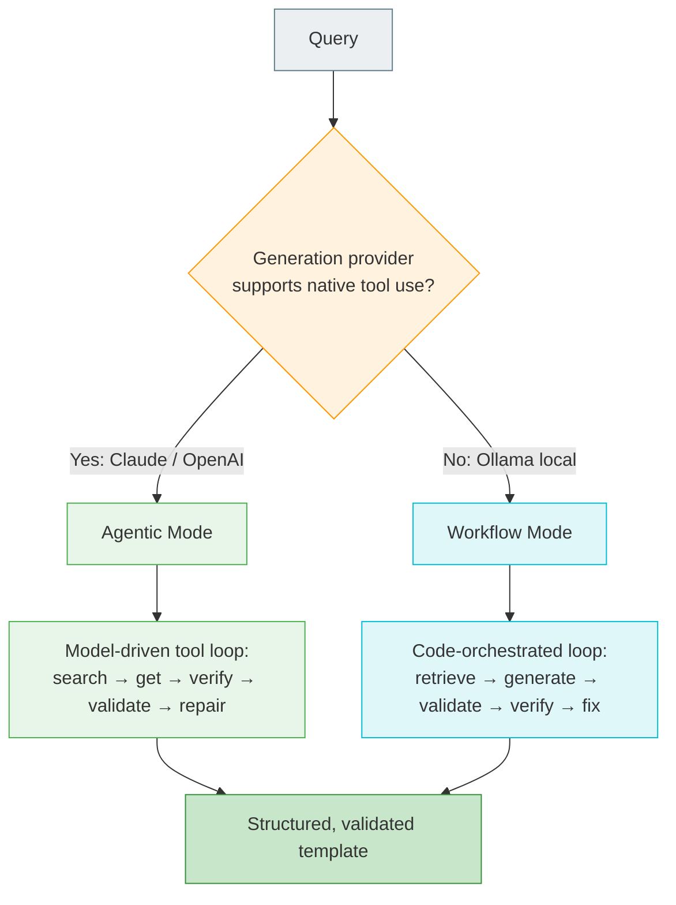
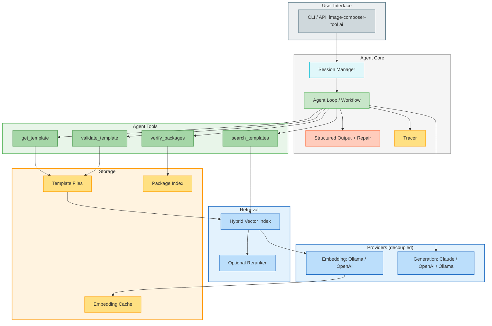
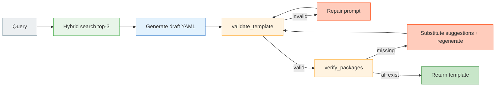

# ADR: Agentic Template-Enriched RAG for AI-Powered Template Generation

**Status**: Proposed
**Date**: 2026-01-05
**Updated**: 2026-07-06
**Authors**: ICT Team
**Technical Area**: AI/ML, Agentic Systems, Template Generation

---

## Summary

This ADR describes the architecture for AI-powered OS image template generation in ICT (`image-composer-tool ai`). The system pairs **Template-Enriched RAG** — semantic metadata embedded directly in template files, indexed for hybrid retrieval — with a **single-agent tool-use loop** that treats retrieval, package verification, and schema validation as *tools the model calls*, rather than a fixed retrieve-then-generate pipeline. The agent self-corrects: it validates its own output, verifies packages against real repositories, and repairs errors before returning a template.

The design is **provider-tiered**. Ollama remains the zero-config default (local, free); Anthropic Claude is added as a first-class agentic provider with native tool use and structured outputs; OpenAI is retained. Because no provider offers both best-in-class embeddings *and* best-in-class agentic tool use, embedding and generation are **decoupled** — a deployment can embed with Ollama locally while generating with Claude.

> **What changed in v2.0.** v1.0 specified a single-shot pipeline (`embed query → top-k → stuff top-3 YAML into one prompt → generate`) and deferred all agentic behavior to a hypothetical "Phase 5." Industry practice moved on: retrieval is now a *tool invoked in a loop*, not a preprocessing step, and self-correction is table stakes, not a future enhancement. This revision promotes the agent loop to the core architecture, reframes retrieval as tool-use, adds structured-output validation, introduces the provider tiers above, and makes evaluation and tracing first-class. See [Revision History](#revision-history).

---

## Context

### Problem Statement

ICT needs an AI system that generates production-ready YAML templates from natural-language descriptions. It must:

1. **Ground** output in real, working templates to reduce hallucination.
2. **Apply** curated best practices (packages, kernel configs, disk layouts) consistently.
3. **Guarantee correctness** — output that passes schema validation and references packages that actually exist in configured repositories.
4. **Support multiple providers** — a free local default, plus cloud providers with stronger reasoning — with different embedding dimensions and tool-use capabilities.
5. **Refine conversationally** across turns.
6. Be observable and evaluable so regressions are caught before release.

### Why the v1.0 single-shot design was insufficient

The v1.0 pipeline embedded the query, took the top-k templates by hybrid score, concatenated the top-3 templates' raw YAML into one prompt, made a single LLM call, and stripped code fences. This lost on two independent axes:

| Axis | v1.0 failure mode |
|------|-------------------|
| **Retrieval control flow** | One fixed retrieval per query. The model cannot broaden a query that returned nothing, narrow one that returned too much, or fetch a specific template it realizes it needs. Retrieval quality is decided *before* the model reasons. |
| **Output correctness** | No validation, no package verification, no repair. A generated template with an invalid package name (`nginx` vs `nginx-core`) or a schema violation is returned verbatim; the user discovers the error at build time. |

Modern practice reframes both: **retrieval becomes a tool the model calls in a loop**, and **the model validates and repairs its own output** before returning. Anthropic's guidance is explicit that a "linear, one-shot pipeline cannot handle" tasks that are path-dependent — the model should decide *whether, what, and how often* to retrieve based on intermediate results ([Building effective agents](https://www.anthropic.com/engineering/building-effective-agents); [How we built our multi-agent research system](https://www.anthropic.com/engineering/built-multi-agent-research-system)).

### Background: the knowledge source

The system's knowledge lives in **Template Examples** (`image-templates/*.yml`): real, working YAML with actual package lists, kernel configs, and disk layouts. Templates carry embedded `metadata` (see [Template Metadata Schema](#template-metadata-schema)) describing purpose, use cases, and keywords, making them self-describing and searchable without external metadata files. As the library grows, new templates expand the system's capabilities organically.

---

## Recommendation

### Recommended approach: single augmented agent over template-enriched RAG

Build **one** augmented agent — an LLM equipped with retrieval, verification, and validation tools plus bounded self-correction — over the existing template-enriched hybrid index. This is deliberately *not* a multi-agent system: template generation is a single-threaded, context-coherent task, and multi-agent architectures use ~15× the tokens of a chat and are a poor fit for anything needing shared context ([multi-agent research system](https://www.anthropic.com/engineering/built-multi-agent-research-system)).

### Core design principles

1. **Start simple; escalate only when justified.** The default path is the smallest thing that works. Full autonomy is reserved for providers that support it and queries that need it.
2. **Retrieval is a tool, not a preprocessing step.** The agent calls `search_templates` / `get_template` in a loop and adapts to what it finds.
3. **Self-describing templates.** Each template carries its own metadata for semantic matching (unchanged from v1.0).
4. **Hybrid scoring** combines semantic similarity, keyword overlap, and package matching for robust ranking (unchanged from v1.0; now serves the `search_templates` tool).
5. **Correct-by-construction output.** The agent validates against the JSON schema and verifies packages against real repositories, repairing errors before returning.
6. **Decoupled providers.** Embedding provider and generation/agent provider are configured independently.
7. **Graceful degradation.** Providers without native tool use fall back to a deterministic code-orchestrated workflow that preserves validation and repair.
8. **Observable and evaluable.** Every run emits a trace; a golden eval set gates releases.

---

## Provider Architecture

### Two independent roles

Retrieval quality depends on the **embedding** model; agentic behavior depends on the **generation** model's tool-use and structured-output support. No single provider is best at both — notably, **Anthropic offers no first-party embedding model**. The system therefore separates the two roles behind distinct interfaces, configured independently:

```go
// EmbeddingProvider turns text into vectors for the index and query.
type EmbeddingProvider interface {
    Embed(ctx context.Context, text string) ([]float32, error)
    ModelID() string
    Dimensions() int
}

// GenerationProvider drives the agent loop (or the workflow fallback).
type GenerationProvider interface {
    // Capabilities reported so the engine picks agentic vs workflow mode.
    Capabilities() ProviderCapabilities
    // RunAgent executes a bounded tool-use loop with the given tools.
    RunAgent(ctx context.Context, req AgentRequest) (*AgentResult, error)
}

type ProviderCapabilities struct {
    NativeToolUse     bool // model-driven function calling
    StructuredOutput  bool // constrained/JSON-schema decoding
    Thinking          bool // extended/adaptive reasoning
}
```

### Provider tiers

| Provider | Role(s) | Embedding model | Generation model | Tool use | Mode |
|----------|---------|-----------------|------------------|----------|------|
| **Ollama** *(default)* | Embedding + Generation | `nomic-embed-text` (768d) | `llama3.1:8b` | limited / unreliable | **Workflow** (deterministic loop) |
| **Anthropic Claude** | Generation only | — *(pair with Ollama/OpenAI)* | `claude-opus-4-8` | native (SDK tool runner) | **Agentic** |
| **OpenAI** | Embedding + Generation | `text-embedding-3-small` (1536d) | `gpt-4o-mini` | native (function calling) | **Agentic** |

**Default posture (zero config):** Ollama for both roles — local, free, offline. Runs in **workflow mode** because small local models do not call tools reliably.

**Recommended agentic posture:** Claude (`claude-opus-4-8`) for generation, Ollama (`nomic-embed-text`) for embeddings. Best-in-class tool use and self-correction, embeddings stay local and free, no embedding vendor lock-in. Claude runs with **adaptive thinking** (`thinking: {type: "adaptive"}`) and a tunable `effort` (default `medium` for this cost-sensitive task), via the official `anthropic-sdk-go` tool runner.

> **Why not embed with Claude?** Anthropic has no embedding endpoint. Attempting to force one provider for both roles would either drop the local/offline embedding path or drop the strongest agent. Decoupling keeps both.

### Capability-driven mode selection



Both modes share the same tools and the same validate/verify/repair invariant. The difference is **who decides the sequence**: the model (agentic) or ICT's code (workflow). This mirrors Anthropic's workflow-vs-agent distinction — workflows are predictable, agents handle open-ended paths — and lets ICT offer the best experience each provider can support without forking the tool implementations.

---

## Diagram Conventions

All diagrams use a consistent color scheme:

| Color | Component Type | Fill | Stroke | Examples |
|-------|---------------|------|--------|----------|
| ⚪ Slate | User Interface / Input | `#ECEFF1` | `#607D8B` | CLI, User Query |
| 🔵 Deep Blue | AI / LLM Operations | `#E3F2FD` | `#1565C0` | Embedding API, LLM |
| 🟣 Purple | Classification / Analysis | `#F3E5F5` | `#9C27B0` | Query Classifier |
| 🟢 Green | RAG / Retrieval / Agentic / Success | `#E8F5E9` | `#4CAF50` | Search tool, Agent loop, Valid output |
| 🟠 Orange | Cache / Decisions | `#FFF3E0` | `#FF9800` | Cache, Conditionals |
| 🔵 Cyan | Workflow / Session | `#E0F7FA` | `#00BCD4` | Workflow mode, Session |
| 🔴 Red-Orange | Errors / Fixes | `#FFCCBC` | `#FF5722` | Repair, Validation failed |

---

## High-Level Architecture



| Component | Responsibility |
|-----------|---------------|
| **Session Manager** | Conversation state, chat history, multi-turn refinement |
| **Agent Loop / Workflow** | Orchestrates the tool-use loop (agentic) or fixed sequence (workflow) |
| **Structured Output + Repair** | Constrains the final template to schema; validate-and-repair for semantic rules |
| **Tracer** | Emits a span per turn (tool calls, scores, validation, token usage) |
| **Agent Tools** | In-process functions wrapping existing ICT code (not separate services) |
| **Hybrid Vector Index** | Semantic + keyword + package scoring; optional rerank stage |
| **Package Index** | Lazy live index of repository metadata (see [Package Verification](#package-verification)) |

---

## The Agent Loop

### Query flow (agentic mode)

```mermaid
sequenceDiagram
    participant U as User
    participant A as Agent (LLM)
    participant T as Tools
    participant V as Validator

    U->>A: "minimal edge image for elxr with nginx"
    Note over A: Reason: broad search first
    A->>T: search_templates("edge minimal elxr", top_k=5)
    T-->>A: 5 template summaries (id, use case, key packages, score)
    Note over A: Pick best match; fetch full YAML
    A->>T: get_template("elxr12-x86_64-edge-raw")
    T-->>A: full YAML
    A->>T: verify_packages(["nginx"], dist="elxr12")
    T-->>A: missing: [nginx] → suggest: [nginx-core]
    Note over A: Correct package name
    A->>V: validate_template(draft YAML)
    V-->>A: valid ✓
    A-->>U: validated template + summary of choices
```

The agent is **prompted to start broad and narrow** (short queries first, evaluate, refine) and to **reflect after each tool result** before the next call — the two behaviors Anthropic found most improve agentic retrieval. Search returns **lightweight summaries, not full YAML** (just-in-time context): the agent pulls full templates via `get_template` only for the candidates it actually uses, keeping the context window lean and the attention budget focused.

### Workflow flow (fallback for weak/local providers)

When the generation provider lacks reliable tool use, ICT orchestrates a fixed sequence in code — the model is called only to *generate* and *repair*, never to *choose tools*:



This is a strict superset of v1.0: same retrieve-then-generate first step, but now with a bounded validate/verify/repair loop. Even the local default gets correct-by-construction output.

### Loop bounds and termination

| Control | Default | Purpose |
|---------|---------|---------|
| `max_turns` | 8 | Hard cap on tool-use iterations (prevents runaway loops) |
| `max_repair_attempts` | 2 | Self-correction attempts on validation failure |
| `max_search_calls` | 4 | Search-tool budget per query |

The loop terminates on: a validated final template, `max_turns` exceeded (return best draft with warnings), or an unrecoverable provider error. On Claude, a **task budget** (`task_budget`, beta) can additionally give the model a token countdown so it wraps up gracefully rather than being cut off mid-turn.

---

## Agent Tools

Tools follow the Agent-Computer Interface (ACI) discipline: **few, consolidated, poka-yoke'd, with actionable errors** ([Writing tools for agents](https://www.anthropic.com/engineering/writing-tools-for-agents)). Each wraps existing ICT code in-process — there are no separate services and no MCP servers (see [MCP](#model-context-protocol-mcp)). Four tools cover the workflow; more tools were shown to *reduce* outcomes, so the set is deliberately minimal.

| Tool | Purpose | Input | Output | Notes |
|------|---------|-------|--------|-------|
| `search_templates` | Rank templates by relevance | `query`, `top_k` (≤10), optional `dist`/`arch`/`image_type` filters | List of **summaries**: `name`, `use_case`, `key_packages`, `score` | JIT: no raw YAML here |
| `get_template` | Fetch one full template | `name` (exact, from search results) | Full YAML + parsed metadata | Errors list valid names |
| `verify_packages` | Check packages exist in repos | `packages[]`, `dist` | `missing[]`, `suggestions{missing→[alt]}` | Backed by the live package index |
| `validate_template` | Validate YAML against JSON schema | `yaml` | `valid`, `errors[]` (path + message + hint) | Wraps ICT's existing validator |

### Design rules applied

- **Poka-yoke inputs.** `get_template` takes an exact `name` that must come from a prior `search_templates` result; on a bad name it returns the valid set rather than an empty error — the model can't fail the same way twice.
- **Actionable errors.** `validate_template` returns each error as `{path, message, hint}` (e.g. `hint: "packages.nginx is not a known package; try nginx-core"`), teaching correct usage rather than emitting an opaque code.
- **Token-efficient results.** `search_templates` returns summaries (name, use case, key packages, score), not full YAML — the single biggest token lever. Full YAML is pulled only via `get_template`.
- **Namespaced, prescriptive descriptions.** Each tool description states *when* to call it, not just what it does (measurably lifts should-call rate on current models).

### Strict schemas

Tool inputs use strict JSON schemas (`additionalProperties: false`, all fields `required`, optionality via nullable unions) so provider-side constrained decoding guarantees valid tool arguments — no argument-parsing retries. On Claude this is `strict: true` on the tool definition; on OpenAI, strict function calling.

---

## Structured Output & Repair

The **final template** is produced under a structured-output constraint plus a semantic validate-and-repair loop:

1. **Constrained decoding** for structural validity. On Claude/OpenAI, the final answer is emitted through a JSON-schema-constrained format (`output_config.format` / structured outputs), guaranteeing the *shape* is valid — no more `cleanYAMLResponse` fence-stripping heuristics.
2. **Semantic validation** for correctness. Constrained decoding cannot enforce cross-field rules (does the disk layout sum correctly? do all packages exist?). `validate_template` + `verify_packages` catch these.
3. **Repair loop.** On failure, the specific errors are fed back to the model (up to `max_repair_attempts`); still-invalid output is returned *with explicit warnings*, never silently.

> This replaces v1.0's `cleanYAMLResponse` string surgery. Structural validity is now guaranteed by the decoder; the effort moves to semantic checks that actually matter.

---

## Retrieval

Retrieval quality is the cheapest, highest-leverage win, and largely carries over from v1.0. The hybrid index, embedding cache, searchable-text construction, and metadata schema are unchanged; they now serve the `search_templates` tool instead of a fixed preprocessing call. Two enhancements are added.

### Hybrid scoring (unchanged)

| Signal | Default weight | Description |
|--------|----------------|-------------|
| Semantic similarity | 70% | Cosine similarity between query and template embeddings |
| Keyword overlap | 20% | Overlap between query tokens and template keywords |
| Package mentions | 10% | Ratio of query-mentioned packages found in template |

`Score = (Ws · Semantic) + (Wk · Keyword) + (Wp · Package) − NegationPenalty`, with weights adjusted by query classification (semantic / package-explicit / keyword-heavy / negation). Dense search alone struggles with exact matches (package names, error codes, jargon); the keyword and package signals cover that gap — the standard hybrid-search rationale.

### New: optional rerank stage

For larger template libraries, a cross-encoder rerank stage can rescore the top-N candidates before they reach the agent (retrieve top-~50 → rerank → top-5). This is off by default (small libraries don't need it) and is a config flag. Anthropic's contextual-retrieval work shows reranking stacks on top of hybrid search for a further large reduction in retrieval failures.

### New: contextual enrichment

`BuildSearchableText` already constructs human-readable text (not raw YAML) for embedding. This is extended toward **contextual retrieval**: prepend a short, template-specific context line describing where the template sits in the library (family, deployment target) before embedding and keyword indexing. Cheap, one-time, and improves recall on ambiguous queries.

### Metadata schema (unchanged from v1.0)

Templates carry an optional `metadata` block (`useCase`, `description`, `keywords`, `capabilities`, `recommendedFor`) enhancing searchability. Templates without metadata remain searchable via inferred keywords from filename, packages, distribution, and image type. See the [original schema](#template-metadata-schema) below.

### Embedding cache (unchanged from v1.0)

Content-hash (SHA256 of the whole file) keyed cache under `./.ai-cache/embeddings/`, invalidated on content or embedding-model change. Detail preserved in [Embedding Cache Strategy](#embedding-cache-strategy) below.

---

## Package Verification

`verify_packages` checks that every package in a draft template exists in the configured repositories, and suggests alternatives for missing ones. It is backed by a **lazy live package index** that reuses ICT's existing repository-metadata parsers (`debutils` for `Packages.gz`/`xz`, `rpmutils.ParseRepositoryMetadata` for `primary.xml`, via `ospackage.PackageInfo`) — the design already recorded in the Web UI / API tech-stack ADR and the OpenAPI template-builder spec. This ADR is the first consumer of that index on the CLI/agent side:

```go
type PackageVerifier interface {
    // Exists reports whether pkg is present for the given distribution.
    Exists(ctx context.Context, dist, pkg string) (bool, error)
    // Suggest returns close alternatives for a missing package name.
    Suggest(ctx context.Context, dist, pkg string) ([]string, error)
}
```

Suggestions use edit-distance plus known aliases (e.g. `nginx → nginx-core`). When the index is unavailable (offline, no repo access), `verify_packages` returns a `degraded` flag and the agent proceeds without hard package guarantees, surfacing that caveat to the user rather than failing.

---

## Conversational Interaction (unchanged intent, agent-native)

Sessions maintain state across turns (`ID`, `CurrentTemplate`, `History`, timestamps). Multi-turn refinement ("add monitoring", "change disk to 8GiB") loads the current template into the agent's context and applies the change through the same validate/verify/repair loop — refinement is not a special code path, it's another turn of the agent with the current template in context. Sessions can optionally persist across CLI invocations (`--continue`). Interaction modes (initial generation, iterative refinement, explanation/summary) are unchanged from v1.0.

---

## Observability & Evaluation

Eval-driven development is the flywheel; the most common cause of failed LLM features is the absence of robust evals. Both are first-class here, not deferred.

### Tracing

Every run emits a structured trace with one span per turn, following **OpenTelemetry GenAI semantic conventions** for portability:

- `invoke_agent` root span → child `execute_tool` spans (`gen_ai.tool.name`), `retrieval` spans (with per-signal scores), and model spans (`gen_ai.usage.input_tokens` / `output_tokens`).
- Captured per run: query classification, cache hit/miss, score breakdowns, tool-call sequence, validation results, repair attempts, token usage, latency.

Spans are emitted asynchronously so tracing does not add request latency. This is what makes agentic behavior debuggable — "debugging without observability is guesswork."

### Evaluation

| Layer | What | Cadence |
|-------|------|---------|
| **L1 — Assertions** | Unit-test invariants: output validates against schema; all packages verified; no invented top-level keys | Every commit |
| **L2 — Golden set** | ~30+ curated `(query → expected template family + must-have packages)` cases; graded on **outcome** (valid, correct family, packages present) and **trajectory** (did it search before generating? did it verify packages?) | Per change to prompts/tools/models |
| **L3 — Manual/LLM-judge** | Subjective quality (is the template idiomatic?), LLM-as-judge with reasoning-before-verdict and position/verbosity-bias mitigations | Per release |

Judgments are **binary pass/fail**, not 1–5 scales. RAG-specific metrics tracked: **faithfulness** (does the template use only retrieved/verified packages?), context precision/recall on the golden set. Realistic target: even good systems have a small residual error rate; the pass bar is a product decision, not 100%.

---

## Configuration

Hybrid config: sensible defaults hardcoded in the binary; users override only what they need. Precedence: hardcoded defaults → `config.yaml` → environment variables.

### Zero config (unchanged)

```bash
$ ollama serve &
$ image-composer-tool ai "create minimal edge image"   # works with local defaults
```

### Agentic with Claude (recommended)

```yaml
ai:
  generation:
    provider: anthropic          # claude drives the agent loop
    anthropic:
      model: claude-opus-4-8     # adaptive thinking + effort: medium
  embedding:
    provider: ollama             # embeddings stay local & free
```

```bash
$ export ANTHROPIC_API_KEY=...   # or use `ant auth login` (OAuth profile)
$ image-composer-tool ai "cloud image for AWS with docker and monitoring"
```

### Configuration reference (additions to v1.0)

| Parameter | Default | Description |
|-----------|---------|-------------|
| `ai.embedding.provider` | `ollama` | Embedding provider: `ollama` or `openai` |
| `ai.generation.provider` | `ollama` | Generation/agent provider: `ollama`, `anthropic`, or `openai` |
| `ai.generation.anthropic.model` | `claude-opus-4-8` | Claude model for the agent loop |
| `ai.generation.anthropic.effort` | `medium` | Reasoning effort (`low`…`max`) |
| `ai.agent.max_turns` | `8` | Tool-use iteration cap |
| `ai.agent.max_repair_attempts` | `2` | Self-correction attempts |
| `ai.agent.verify_packages` | `true` | Verify package existence before returning |
| `ai.retrieval.rerank.enabled` | `false` | Enable the cross-encoder rerank stage |
| `ai.observability.tracing` | `true` | Emit OTel GenAI traces |

All v1.0 parameters (Ollama/OpenAI models, cache, scoring weights, classification thresholds, conversation settings) are retained; `provider` is superseded by the split `embedding.provider` / `generation.provider` (with a compatibility shim mapping the old single `provider` to both).

### Environment variables

| Variable | Description |
|----------|-------------|
| `ANTHROPIC_API_KEY` | Anthropic API key (or use an `ant auth login` OAuth profile) |
| `OPENAI_API_KEY` | OpenAI API key (OpenAI provider) |
| `OLLAMA_HOST` | Ollama server URL |
| `ICT_AI_GENERATION_PROVIDER` / `ICT_AI_EMBEDDING_PROVIDER` | Runtime provider overrides |

---

## CLI Interface

```bash
image-composer-tool ai "create a minimal edge image for elxr"   # single-shot
image-composer-tool ai --interactive                            # conversation mode
image-composer-tool ai --continue                               # resume last session
image-composer-tool ai --search-only "cloud aws"                # retrieval only, no generation
image-composer-tool ai --trace                                  # print the run trace
image-composer-tool ai --clear-cache | --cache-stats            # cache management
```

---

## Alternatives Considered

### Multi-agent orchestration (planner + retriever + validator subagents)

**Rejected.** Template generation is single-threaded and context-coherent. Multi-agent systems use ~15× the tokens of chat, and Anthropic reports they are a poor fit for tasks needing shared context, where "errors compound." A single augmented agent captures the benefit at a fraction of the cost.

### Keep the v1.0 single-shot pipeline

**Rejected.** It cannot adapt retrieval to intermediate findings and returns unvalidated, unverified output. It survives only as the *first step* of the workflow-mode fallback, now wrapped in validation and repair.

### Expose tools via MCP servers

**Rejected for now.** MCP is warranted when the *same* capability is consumed by *multiple* hosts. ICT's tools are bespoke, single-application, and in-process; an MCP layer would add transport overhead and operational surface for no reuse benefit. Revisit if a Web UI or third-party host needs the same tools (see [MCP](#model-context-protocol-mcp)).

### LLM-based re-ranking of every search

**Deferred.** A cross-encoder rerank stage (config flag) is the pragmatic middle ground; per-query LLM re-ranking adds latency and cost that only large libraries justify.

---

## Model Context Protocol (MCP)

MCP is an open standard for exposing tools/resources to AI hosts — "USB-C for AI applications." The decision rule: **MCP when a capability is consumed by multiple hosts; in-process when it's bespoke to one application.** ICT's tools are the latter today, so they are plain in-process Go functions. If the planned Web UI (or an external assistant) later needs the same `search_templates` / `verify_packages` capabilities, promoting them to an MCP server becomes attractive — the tool *contracts* defined here are designed to port cleanly to MCP tool definitions if that day comes.

---

## Consequences

### Expected benefits

| Benefit | Description |
|---------|-------------|
| Correct-by-construction | Output validates against the schema and references only real packages, in every mode |
| Adaptive retrieval | The agent broadens/narrows/refetches based on what it finds |
| Best experience per provider | Native tool use where available; deterministic fallback where not |
| No embedding lock-in | Local/free embeddings with any generation provider |
| Debuggable | Every run is traced; failures are inspectable, not opaque |
| Regression-gated | Golden eval set catches quality drops before release |
| Lower token cost | JIT context (summaries, not full YAML) keeps the window lean |

### Trade-offs

| Trade-off | Mitigation |
|-----------|------------|
| Agentic mode adds tool-call round trips (latency, tokens) | Bounded `max_turns`; JIT context; workflow fallback for local |
| Package verification needs repo access | `degraded` flag + explicit caveat when offline |
| Two providers to configure for the recommended posture | Zero-config Ollama default unchanged; split has a compat shim |
| More moving parts than v1.0 | Shared tools across modes; strong tracing; eval gate |

### Risks

| Risk | Likelihood | Impact | Mitigation |
|------|------------|--------|------------|
| Agent loops without converging | Low | Medium | `max_turns` / `max_repair_attempts` caps; task budget on Claude |
| Local model can't drive tools | High (expected) | Low | Detected by capability check → workflow mode |
| Package index unavailable | Medium | Low | Degraded mode with caveat |
| Provider API drift | Medium | Medium | Official SDKs (`anthropic-sdk-go`); tool runner handles the loop |

---

## Implementation Considerations

### Phased roadmap (revised)

**Phase 1 — Foundations (largely built in v1.0).** Template parser + metadata, embedding cache, hybrid index, embedding/generation provider split, Ollama + OpenAI providers.

**Phase 2 — Tools + workflow mode.** Implement the four tools over existing ICT code (`validate_template` wraps the schema validator; `verify_packages` wires up the live package index). Ship the deterministic validate/verify/repair workflow for all providers. *This alone makes the local default correct-by-construction.*

**Phase 3 — Agentic mode + Claude.** Add the Anthropic provider (`anthropic-sdk-go` tool runner, adaptive thinking, strict tools, structured output). Capability-driven mode selection. Structured-output final answer + repair loop.

**Phase 4 — Observability + evaluation.** OTel GenAI tracing; golden eval set with L1/L2 assertions wired into CI; `--trace` CLI flag.

**Phase 5 — Retrieval quality + refinement.** Optional rerank stage; contextual enrichment; conversational session persistence (`--interactive`, `--continue`).

### Success metrics

| Metric | Target | Measurement |
|--------|--------|-------------|
| Output validity | 100% in workflow+agentic modes | L1 assertions |
| Package correctness | >95% packages exist on first return | `verify_packages` on golden set |
| Retrieval accuracy | >85% relevant in top-3 | Golden-set outcome grading |
| Repair success | >90% invalid drafts repaired within 2 attempts | Trace analysis |
| Query latency (agentic, cached embeddings) | <6s P95 | Traces |
| Query latency (workflow) | <2s P95 (Ollama) | Traces |
| Cache hit rate | >80% after warmup | Cache stats |

---

## Appendix — Preserved v1.0 Detail

The following sections are carried forward from v1.0 with technical content intact; they remain accurate under the new architecture.

### Template Metadata Schema

Templates include an optional `metadata` section:

```yaml
metadata:
  useCase: cloud-deployment
  description: "Cloud-ready eLxr image for VM deployment on AWS, Azure, GCP"
  keywords: [cloud, cloud-init, aws, azure, gcp, vm]
  capabilities: [security, monitoring]
  recommendedFor: ["cloud VM deployment", "auto-scaling environments"]

image:
  name: elxr-cloud-amd64
  version: "12.12.0"
target:
  os: wind-river-elxr
  dist: elxr12
  arch: x86_64
  imageType: raw
# ... rest of template configuration
```

| Field | Required | Description |
|-------|----------|-------------|
| `useCase` | No | Primary use case category |
| `description` | No | Human-readable description for semantic matching |
| `keywords` | No | Terms that help match queries |
| `capabilities` | No | Feature tags (security, monitoring, performance) |
| `recommendedFor` | No | Natural-language descriptions of ideal use cases |

Templates without metadata remain searchable via inferred keywords (filename, packages, distribution, image type).

### Searchable Text Construction

For each template, searchable text combines structural content (filename, image name, distribution, architecture, image type, package lists) with embedded metadata (use case, description, keywords, capabilities). The system embeds this human-readable text — **not** raw YAML syntax — for better similarity vectors. The cache hash is computed from the **entire file** (any change triggers re-embedding); the searchable text is constructed from **selected fields** (optimized for search quality). v2.0 optionally prepends a contextual line (see [Contextual enrichment](#new-contextual-enrichment)).

### Embedding Cache Strategy

Embeddings are cached to avoid redundant API calls and speed startup.

- **Directory:** `./.ai-cache/embeddings/` with `index.json` (metadata: model id, dimensions, entries keyed by content hash) and per-vector `.bin` files (raw `float32`, little-endian).
- **Content hash:** SHA256 of the whole template file, first 16 chars as the key. Whole-file hashing is simpler and correct (any change re-embeds) at the cost of re-embedding on non-semantic edits — negligible (~100ms/template with Ollama).
- **Model-id check:** embeddings from different models have incompatible dimensions (768 vs 1536 vs 3072) and cannot be mixed; a model change invalidates the entire cache.
- **Invalidation:** template content change → cache miss → regenerate; embedding-model change → clear entire cache; manual `--clear-cache`.

```go
func computeContentHash(templatePath string) (string, error) {
    content, err := os.ReadFile(templatePath)
    if err != nil {
        return "", err
    }
    hash := sha256.Sum256(content)
    return hex.EncodeToString(hash[:])[:16], nil
}
```

### Query Classification

Queries are classified to apply appropriate scoring weights: **semantic** (default weights), **package-explicit** (≥2 packages → boost package weight), **keyword-heavy** (high technical-term density → boost keyword weight), **negation** ("without X" → exclusion penalty), and **refinement** (has session context → operate on current template). Scoring profiles and negation handling are unchanged from v1.0.

---

## References

- Anthropic, [Building effective agents](https://www.anthropic.com/engineering/building-effective-agents) — workflows vs. agents, the augmented LLM, start-simple, tool-design (ACI, poka-yoke).
- Anthropic, [How we built our multi-agent research system](https://www.anthropic.com/engineering/built-multi-agent-research-system) — agentic retrieval, broad-then-narrow, reflection, single- vs multi-agent cost.
- Anthropic, [Writing tools for agents](https://www.anthropic.com/engineering/writing-tools-for-agents) — consolidate tools, token-efficient results, actionable errors, namespacing.
- Anthropic, [Effective context engineering for AI agents](https://www.anthropic.com/engineering/effective-context-engineering-for-ai-agents) — just-in-time retrieval, attention budget, context rot.
- Anthropic, [Introducing Contextual Retrieval](https://www.anthropic.com/news/contextual-retrieval) — contextual embeddings + BM25 + reranking, stacked recall gains.
- [Model Context Protocol](https://modelcontextprotocol.io/introduction) — when to expose capabilities via MCP.
- Yan, [LLM evaluators (LLM-as-judge)](https://eugeneyan.com/writing/llm-evaluators/) — pointwise vs pairwise, bias mitigations.
- Husain, [Your AI product needs evals](https://hamel.dev/blog/posts/evals/) — eval hierarchy, binary judgments, error analysis.
- [OpenTelemetry GenAI semantic conventions](https://github.com/open-telemetry/semantic-conventions) — span/attribute naming for LLM/agent tracing.
- Lewis et al., [Retrieval-Augmented Generation for Knowledge-Intensive NLP Tasks](https://arxiv.org/abs/2005.11401) — foundational RAG.
- [Corrective RAG (CRAG)](https://arxiv.org/abs/2401.15884) and [Self-RAG](https://arxiv.org/abs/2310.11511) — retrieval grading and self-reflective retrieval.

---

## Revision History

| Version | Date | Author | Changes |
|---------|------|--------|---------|
| 1.0 | 2026-01-05 | | Initial version — template-enriched RAG, single-shot generation, agentic capabilities deferred to Phase 5. |
| 2.0 | 2026-07-06 | | Redesign to a single-agent tool-use architecture. Retrieval reframed as tools (`search_templates`/`get_template`); added `verify_packages`/`validate_template`. Promoted self-correction (validate/verify/repair) from deferred to core. Introduced decoupled embedding/generation providers and provider tiers (Ollama default, Claude first-class agentic via `anthropic-sdk-go`, OpenAI). Added capability-driven agentic-vs-workflow mode selection, structured-output final answer, optional reranking + contextual enrichment, and first-class OTel tracing + golden-set evaluation. Wired `verify_packages` to the planned live package index. Revised roadmap, alternatives (incl. multi-agent and MCP), consequences, and metrics. |
